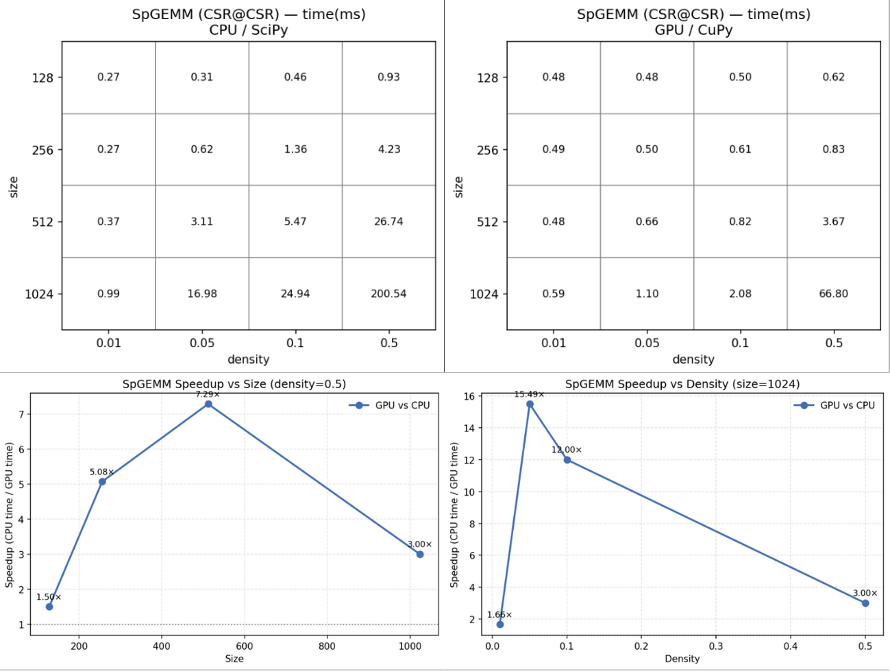
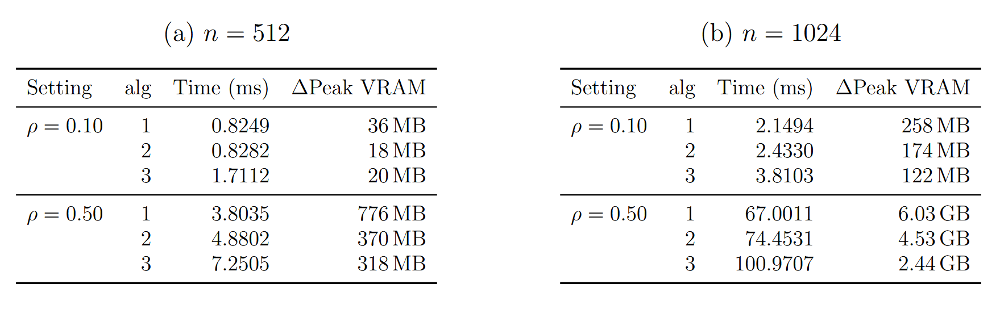
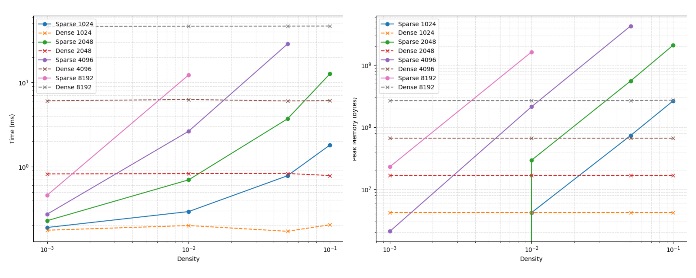

# Sparse Matrix Multiplication Benchmarks (Reproducibility Guide)

This repository contains benchmark scripts used in our project report.  
Please follow the instructions below to set up the environment and reproduce the benchmark result `.txt` files.

---

## 0. Environment Setup (Required)

### 0.1 Install and use the modified CuPy source

We vendor a **modified CuPy source tree** under `modify_src/cupy-src` and install it in an isolated conda environment so the benchmarks run against our customized build.  
This setup step mainly: (1) creates a conda env, (2) installs required toolchain/runtime packages, (3) sets CUDA-related environment variables, and (4) installs CuPy from source in editable mode.

To avoid manual setup, we provide a one-shot installer script:

```bash
bash install.sh
```

---

## 1. Running the Benchmarks

Each benchmark directory contains a `run.sh` script.

Steps:
1. `cd` into the directory
2. run `bash run.sh`
3. after completion, benchmark result `.txt` file(s) will be generated and can be used for inspection and verification

---

## 2. Benchmark Directories

### A) `SpGEMM_vs_SpMV`

**Description:**  
This directory reproduces the comparison between SpGEMM (sparse × sparse) and SpMV (sparse × dense vector) behavior. In the report, SpMV is shown to be strongly memory/transfer sensitive, and end-to-end GPU performance can look worse than CPU once H2D is included.  


  


**How to run:**
```bash
cd SpGEMM_vs_SpMV
bash run.sh
```

**Output:**  
Benchmark result `.txt` file(s) generated after execution.

---

### B) `SpGEMM_alg_comparison`

**Description:**  
This directory compares cuSPARSE SpGEMM algorithm variants (ALG1/ALG2/ALG3) and highlights the core trade-off: ALG1 is fastest but uses the most VRAM, while ALG3 reduces peak memory via chunking but is typically slowest, and ALG2 is a middle ground.  


  

**How to run:**
```bash
cd SpGEMM_alg_comparison
bash run.sh
```

**Output:**  
Benchmark result `.txt` file(s) generated after execution.

---

### C) `dense_vs_sparseGEMM`

**Description:**  
This directory reproduces the CSR@CSR SpGEMM vs dense GEMM comparison under an inputs-on-GPU setting (i.e., focusing on operator behavior rather than transfer overheads).
The report’s main finding here is that sparse computation is only beneficial in an extremely sparse regime, and the break-even point shifts with matrix size.  

  


**How to run:**
```bash
cd dense_vs_sparseGEMM
bash run.sh
```

**Output:**  
Benchmark result `.txt` file(s) generated after execution.

**Note:**
Omit ``others'' folder which contain legacy file.
